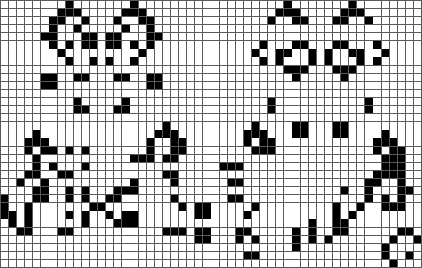
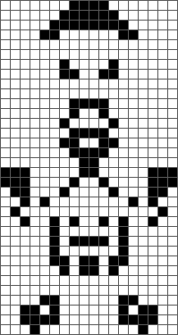

# Alife

> :construction: This project is currently under development, so there may be bugs and it is currently impossible to generate videos.

Alife (*Animated Life*) is a program that simulates the Conway's Game of Life. It can read RLE files to generate images, videos and RLE files.

### Game of Life ?

The Game of Life is a cellular automaton devised by the British mathematician John Horton Conway in 1970. [Wikipedia](https://en.wikipedia.org/wiki/Conway%27s_Game_of_Life)

**Rules:**
1. Each cell with one or no neighbors dies, as if by solitude.
2. Each cell with four or more neighbors dies, as if by overpopulation.
3. Each cell with two or three neighbors survives.
4. Each cell with three neighbors becomes populated.


## Features

- Generate images
- Generate videos :construction:
- Generate RLE files


## Installation

Clone the repository.

```
git clone https://github.com/thomas-souchet/ALife.git
```

Build the project. To install Cargo: [Rust documentation](https://doc.rust-lang.org/cargo/getting-started/installation.html)

```
cargo build --release
```

The generated executable is in `target/release/`.

```
./alife -V
```

## Usage

Basic usage.

```
./alife -f pattern.rle -g 100
```

Use `-h` to see the documentation.

```
Alife is a program that simulates the Conway's Game of Life. It can read RLE files to generate images, GIF and RLE files

Usage: alife [OPTIONS] --file <FILE> --gen <GEN>

Options:
  -f, --file <FILE>  RLE file to load for initial configuration
  -g, --gen <GEN>    Number of generations to simulate
  -o, --output       Display the result on standard output instead of writing to a file
  -h, --help         Print help
  -V, --version      Print version
```

To use the program you need to give it a RLE file that represents a figure from the Game of Life and a number of generations to apply. The program will generate two files: a PNG image and a RLE file.

The convention used to describe the figures in the Game of Life is the RLE (Run Length Encoded) format, which is described [here](https://conwaylife.com/wiki/Run_Length_Encoded).

You will find a large number of patterns at this [link](https://conwaylife.com/wiki/Category:Patterns).


## Images/Examples

**Pufferfish spaceship - 300 generations**



**114P6H1V0 - 100 generations**



